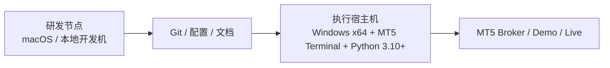

# MT5 执行宿主机部署 Runbook

## 目标

把当前仓库拆成两类节点：

1. 研发 / 回放 / 文档节点
2. MT5 执行宿主机

当前这台开发机已经验证到：

- 可继续做研发、回放、预警逻辑、文档维护
- 但本机 `pip install MetaTrader5` 失败
- 因此不建议把它继续当作 MT5 真实执行宿主机
- 本地 MT5 手工联调已基本打通
  说明：黄金品种 `XAUUSD` 规格已核对，测试账号最小手工单已成功开平

如果当前没有 Windows 电脑，优先参考：

- `docs/implementation/china_user_host_provider_options.md`
- `docs/implementation/azure_windows_temporary_host_quickstart.md`

这两份补充文档更适合“先搭一台临时 Windows 宿主机，把 MT5 跑起来”的场景。

## 推荐拓扑



## 执行宿主机建议

建议优先使用：

- Windows x64
- Python 3.10+
- 已安装并可正常登录的 MT5 Terminal
- 与券商账户网络连通稳定

## 宿主机准备步骤

### 1. 安装基础环境

- 安装 Python 3.10 或更高版本
- 安装 MT5 Terminal
- 在 MT5 Terminal 中完成账号登录
- 确认终端可以手工看到 `XAUUSD`

### 2. 拉取仓库

```bash
git clone https://github.com/hudrew/xauusd-ai-trading-system.git
cd xauusd-ai-trading-system
python -m venv .venv
```

### 可选：在仓库目录内直接用脚本完成 Python 自举

```powershell
powershell -ExecutionPolicy Bypass -File .\scripts\mt5_bootstrap.ps1
```

如果执行宿主机还需要研究回放依赖：

```powershell
powershell -ExecutionPolicy Bypass -File .\scripts\mt5_bootstrap.ps1 -WithResearch
```

### 3. 安装依赖

先安装项目基础依赖：

```bash
.venv\\Scripts\\python -m pip install -e .
```

如果宿主机只负责 MT5：

```bash
.venv\\Scripts\\python -m pip install -e ".[mt5]"
```

如果还要做研究回放：

```bash
.venv\\Scripts\\python -m pip install -e ".[research,mt5]"
```

### 4. 准备本地环境变量

复制模板：

```bash
copy .env.mt5.example .env.mt5.local
```

至少填写：

- `XAUUSD_AI_MT5_LOGIN`
- `XAUUSD_AI_MT5_PASSWORD`
- `XAUUSD_AI_MT5_SERVER`
- `XAUUSD_AI_MT5_PATH`

常用可调但非必填：

- `XAUUSD_AI_RISK_CONTRACT_SIZE`
- `XAUUSD_AI_MT5_DEVIATION`
- `XAUUSD_AI_MT5_MAGIC`
- `XAUUSD_AI_RISK_MAX_SPREAD_RATIO`
- `XAUUSD_AI_STATE_SPREAD_RATIO_MAX`
- `XAUUSD_AI_VOLATILITY_SPREAD_RATIO_TRIGGER`

根据节点用途设置：

- `XAUUSD_AI_ENV=paper`
- 或 `XAUUSD_AI_ENV=prod`

## 启动前检查

### 第一步：检查宿主机是否适合跑 MT5

```bash
bash scripts/mt5_host_check.sh .env.mt5.local
```

```powershell
powershell -ExecutionPolicy Bypass -File .\scripts\mt5_host_check.ps1 .env.mt5.local
```

重点检查：

- 是否为 Windows x64
- Python 版本是否满足要求
- `MetaTrader5` 模块是否可导入
- MT5 Terminal 路径是否有效
- 登录凭据是否齐全

### 第二步：检查平台是否已经就绪

```bash
bash scripts/mt5_preflight.sh .env.mt5.local
```

```powershell
powershell -ExecutionPolicy Bypass -File .\scripts\mt5_preflight.ps1 .env.mt5.local
```

重点检查：

- MT5 initialize
- account_info
- terminal_info
- symbol_select
- contract_size_alignment
- latest_tick
- recent_bars
- trade_permission

当前联调经验补充：

- 如果 `latest_tick` 存在，但 `bid=0 / ask=0`
  通常优先表示“品种当前停盘”或“此刻没有活跃报价”，不应第一时间误判成网络断开
- 如果 `recent_bars` 仍然能拉到，说明 MT5 初始化、symbol 选择和历史数据链通常是通的
- 如果同时 `trade_allowed=false`
  需要再区分是停盘期的正常状态，还是账户本身被券商禁用了交易权限

也就是说，停盘期最值得看的不是单独一个 `bid/ask`，而是要把：

- `latest_tick`
- `recent_bars`
- `account_info.trade_allowed`
- `terminal_info.tradeapi_disabled`

放在一起判断。

### 第三步：先做一次单次联调

```bash
bash scripts/mt5_live_once.sh .env.mt5.local
```

```powershell
powershell -ExecutionPolicy Bypass -File .\scripts\mt5_live_once.ps1 .env.mt5.local
```

目标：

- 验证 MT5 实时行情拉取
- 验证特征计算链是否通
- 验证状态识别、高波动预警、风控输出是否正常
- 在进入持续轮询前先确认一轮完整决策链
- 当前执行适配器会在下单前自动按券商 `symbol_info` 归整手数步长，并按 `stops level` 修正止损止盈距离

当前说明：

- `mt5_live_once` 脚本现在默认会带上 `deploy-gate + preflight`
- 也就是说，脚本入口已经不是“只拉一次行情”，而是“先过门禁，再跑一次完整联调”

### 研究数据导出

如果这台 Windows 宿主机同时负责导出历史数据做研究验收，可以直接导出最近一段 MT5 bars：

```powershell
powershell -ExecutionPolicy Bypass -File .\scripts\mt5_export_history.ps1 .env.mt5.local .\tmp\xauusd_m1_history.csv --bars 20000 --timeframe M1
```

导出后的 CSV 已经是项目可直接读取的格式，包含：

- `timestamp`
- `open / high / low / close`
- `bid / ask`
- `spread`
- `volume / tick_volume`

其中 bar 内 `spread` 会从 MT5 的“点数”自动换算成真实价格差，避免回测或特征层误把点差放大。

建议紧接着执行：

```powershell
.venv\Scripts\python.exe -m xauusd_ai_system.cli --config configs\mvp.yaml acceptance .\tmp\xauusd_m1_history.csv
```

### 研究验收归档导入

如果研究回测不在这台 Windows 宿主机上执行，而是在本地研发机完成，先把研究报告导入当前宿主机：

```powershell
.venv\Scripts\python.exe -m xauusd_ai_system.cli report-import C:\work\incoming\acceptance_latest.json --report-dir reports/research
```

建议马上核对：

```powershell
.venv\Scripts\python.exe -m xauusd_ai_system.cli reports latest --report-dir reports/research
```

确认最新 `acceptance` 已存在、`ready=true`、`checked_at` 在允许时效内，再继续跑 `mt5_deploy_gate.ps1`。

## 启动顺序

### 纸面盘

```bash
bash scripts/mt5_host_check.sh .env.mt5.local
bash scripts/mt5_preflight.sh .env.mt5.local
bash scripts/mt5_deploy_gate.sh .env.mt5.local
bash scripts/mt5_live_once.sh .env.mt5.local
bash scripts/mt5_paper_loop.sh .env.mt5.local --iterations 10
```

```powershell
powershell -ExecutionPolicy Bypass -File .\scripts\mt5_host_check.ps1 .env.mt5.local
powershell -ExecutionPolicy Bypass -File .\scripts\mt5_preflight.ps1 .env.mt5.local
powershell -ExecutionPolicy Bypass -File .\scripts\mt5_deploy_gate.ps1 .env.mt5.local
powershell -ExecutionPolicy Bypass -File .\scripts\mt5_live_once.ps1 .env.mt5.local
powershell -ExecutionPolicy Bypass -File .\scripts\mt5_paper_loop.ps1 .env.mt5.local --iterations 10
```

### 生产盘

```bash
bash scripts/mt5_host_check.sh .env.mt5.local
bash scripts/mt5_preflight.sh .env.mt5.local
bash scripts/mt5_deploy_gate.sh .env.mt5.local
bash scripts/mt5_live_once.sh .env.mt5.local
bash scripts/mt5_prod_loop.sh .env.mt5.local
```

```powershell
powershell -ExecutionPolicy Bypass -File .\scripts\mt5_host_check.ps1 .env.mt5.local
powershell -ExecutionPolicy Bypass -File .\scripts\mt5_preflight.ps1 .env.mt5.local
powershell -ExecutionPolicy Bypass -File .\scripts\mt5_deploy_gate.ps1 .env.mt5.local
powershell -ExecutionPolicy Bypass -File .\scripts\mt5_live_once.ps1 .env.mt5.local
powershell -ExecutionPolicy Bypass -File .\scripts\mt5_prod_loop.ps1 .env.mt5.local
```

## 上线前必须确认的点

- `host-check` 通过
- `preflight --strict` 通过
- `dry_run=true` 先联调
- 纸面盘连续运行稳定
- 审计库里同时看到：
  - `evaluations`
  - `execution_attempts`

## 长期运行与自恢复

如果 Windows 宿主机要长期跑 `paper` 或 `prod`，当前建议优先用系统自带的 `Task Scheduler`，而不是先引入额外守护工具。

注册纸面盘任务：

```powershell
powershell -ExecutionPolicy Bypass -File .\scripts\mt5_register_task.ps1 -Mode paper -EnvFile .env.mt5.local -StartAfterRegister
```

注册生产盘任务：

```powershell
powershell -ExecutionPolicy Bypass -File .\scripts\mt5_register_task.ps1 -Mode prod -EnvFile .env.mt5.local -StartAfterRegister
```

默认行为：

- 任务名默认是 `xauusd-ai-paper-loop` 或 `xauusd-ai-prod-loop`
- 触发方式默认是“用户登录后启动”
- 任务实际先拉起 `mt5_task_runner.ps1`，再由它调用仓库内 `mt5_paper_loop.ps1` 或 `mt5_prod_loop.ps1`
- `mt5_task_runner.ps1` 会把 stdout / stderr 落到 `var/xauusd_ai/task_logs/<mode>/run_<timestamp>.log`
- 默认只保留最近 20 份任务日志，避免宿主机长期运行后日志无限增长
- 因为循环脚本已经带 `deploy-gate + preflight`，所以计划任务启动时也会沿用同一套门禁

查看任务状态：

```powershell
powershell -ExecutionPolicy Bypass -File .\scripts\mt5_task_status.ps1 -Mode paper
```

查看任务状态并直接看最新日志尾部：

```powershell
powershell -ExecutionPolicy Bypass -File .\scripts\mt5_task_status.ps1 -Mode prod -TailLog
```

这条命令会输出：

- `state`
- `enabled`
- `last_run_time`
- `last_task_result`
- `runner_script`
- `env_file`
- `log_dir`
- `latest_log`

删除任务：

```powershell
powershell -ExecutionPolicy Bypass -File .\scripts\mt5_unregister_task.ps1 -Mode paper
```

```powershell
powershell -ExecutionPolicy Bypass -File .\scripts\mt5_unregister_task.ps1 -Mode prod
```

当前推荐：

- 先把 `paper` 跑稳，再注册 `prod`
- 优先在已验证可手工登录 MT5 的用户会话下注册任务
- 如果后续需要更细的服务治理，再评估 `nssm` 或更完整的守护层

## 失败时先看哪里

### host-check 不通过

优先看：

- 宿主机是不是 Windows x64
- Python 是否 >= 3.10
- `MetaTrader5` 是否能导入
- `XAUUSD_AI_MT5_PATH` 是否真实存在

### preflight 不通过

优先看：

- MT5 Terminal 是否已经登录
- 账号权限是否允许交易
- `XAUUSD` 是否可见
- 最近 bars 是否拉取成功
- 如果 `latest_tick` 里 `bid/ask=0`
  先确认是不是停盘期；只要 `recent_bars` 还能拉到，就不要先把问题归咎到网络或 SSH

### live-loop 运行失败

优先看：

- `powershell -ExecutionPolicy Bypass -File .\scripts\mt5_task_status.ps1 -Mode prod -TailLog`
- `var/xauusd_ai/task_logs/<mode>/` 下最近一份运行日志
- `var/` 或数据库中的审计记录
- 结构化日志里的 `live_cycle_failed`
- `execution_attempts` 表中的错误信息

## 当前阶段建议

在 cTrader 异步会话层补完之前：

- 先把 MT5 执行宿主机跑稳
- 先完成 paper 到小资金 live 的闭环
- 把高波动预警、风控缩仓、执行审计三条链一起验证
- Windows 宿主机优先使用仓库内 `.ps1` 脚本作为标准启动入口
