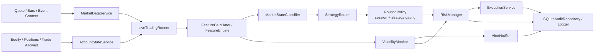

# 系统主流程与重要节点

## 一张图理解

## 主流程

### 1. 数据进入

输入包括：
- 实时 quote
- 最近 K 线
- 点差
- 事件日历

目标：
- 清洗
- 对齐时区
- 统一成系统标准格式

当前代码中，这一步由 `MarketDataService + AccountStateService + LiveTradingRunner` 承接。

### 2. 特征计算

核心产出：
- ATR
- EMA
- VWAP
- Bollinger
- breakout_distance
- spread_ratio
- realized_volatility

这一层是整个系统的公共底座，交易决策和波动预警都会复用。

当前代码中，这一步由 `FeatureCalculator + FeatureEngine` 承接。

当前实现已经支持从 `M1` 原始数据衍生：

- `M5 / M15 / H1` 多周期 ATR / EMA
- `boll_mid / boll_upper / boll_lower / bollinger_position`
- `weekday / hour_bucket`
- `regime_conflict_score`

### 3. 市场状态识别

系统判断当前更接近：
- `trend_breakout`
- `pullback_continuation`
- `range_mean_reversion`
- `no_trade`

输出：
- 状态标签
- 置信度
- 原因码

当前实现补充：

- `trend_breakout` 与 `pullback_continuation` 已纳入 `M5 / M15 / H1` 趋势同向过滤
- `range_mean_reversion` 已纳入高周期趋势过滤，避免在明显趋势日误判区间环境

### 4. 高波动预警

系统独立评估：
- 未来 5 分钟
- 未来 15 分钟
- 未来 30 分钟

是否更可能进入高波动状态。

输出：
- 预警等级
- 风险评分
- 时间窗
- 原因码
- 建议动作

### 5. 策略生成与准入

只有在状态允许时，策略模块才生成候选信号。

例如：
- `trend_breakout` 调用突破策略
- `pullback_continuation` 调用回踩延续策略
- `range_mean_reversion` 调用区间回归策略
- `no_trade` 不允许新开仓

候选信号生成后，还要再经过一层统一准入：

- 按 `routing.allowed_sessions / blocked_sessions` 做时段放行
- 按 `routing.enabled_strategies / disabled_strategies` 做策略开关放行
- 即使候选信号被挡下，也会保留审计上下文，便于回测和复盘

当前研究默认值：

- 暂时关闭 `breakout`
- 暂时不做 `asia`
- 先保留 `eu / overlap / us`

这一步的原因不是“拍脑袋收缩”，而是基于 MT5 `40k bars` 基线：

- `asia` 明显拖累收益
- `breakout` 当前弱于 `pullback`
- 如果直接切成“只做 us”，会和现有 `session_profit_concentration` 验收规则冲突

### 5.1 自动切换和人工迭代的边界

当前系统已经支持：

- 盘中自动识别市场状态
- 在已内置的策略之间自动切换
- 按时段和策略开关自动做准入过滤

但当前系统不会自动做这些事情：

- 自动改核心代码
- 自动发明新策略
- 自动重写参数体系
- 自动放宽风控或验收门槛

更准确地说，当前是：

- “盘中自动切换内置策略”
- “盘后人工根据研究结果迭代代码和配置”

这样做的原因是：

- 生产环境更可控
- 每次改动都可回测
- 每次放行都可审计
- 出问题时更容易定位是“策略问题”还是“行情变化”

### 6. 风控审核

风控是最终关口。

它会综合：
- 账户风险
- 点差
- 新闻
- 当前仓位
- 高波动预警结果

来决定：
- 放行
- 降低仓位
- 禁止开仓

当前代码中，`VolatilityMonitor` 的输出已经会影响 `RiskManager` 的最终仓位缩放和禁开判断。

当前实现补充：

- 趋势型信号在多周期仅部分同向时会自动降仓
- 趋势型信号在多周期明显反向时会直接被风控阻断

### 7. 执行与状态同步

执行层负责：
- 下单
- 带止损止盈
- 管理订单状态
- 处理异常和重试

当前仓库中：

- `MT5` 已经具备首版可接入能力
- `cTrader` 已统一到接口层，但还需要补完异步会话与历史 bar 拉取
- `MT5` 现在还新增了首版执行同步：
  - 下单后会回读 `open orders / open positions`
  - 后续每轮 live loop 还会继续做 broker reconcile
  - 同步结果会落到 `execution_syncs`
  - 同步记录里会补充：
    - `sync_origin`
    - `requested_price / observed_price`
    - `position ticket / position id`
    - `history order state`
    - `history deal entry / reason`
    - `price_offset`
    - `adverse_slippage_points`
    - `history_orders / history_deals`
  - 当前周期对账已经能直接补：
    - `position_open / order_open`
    - `position_closed_tp / position_closed_sl`
    - `position_closed_manual / position_closed_expert`
  - 同步记录现在只在状态变化时落库，避免监控统计被轮询噪声冲歪

### 8. 复盘与报表

系统最终要沉淀：
- 策略表现
- 状态表现
- 时段表现
- 预警效果
- 风控拦截效果

当前代码里，这一层已经有第一版可直接落地的入口：

- `HistoricalReplayRunner`
- `xauusd_ai_system.cli replay`
- `run_backtrader_csv`
- `xauusd_ai_system.cli backtest`
- `xauusd_ai_system.cli sample-split`
- `xauusd_ai_system.cli walk-forward`
- `xauusd_ai_system.cli acceptance`

当前已经能直接输出的验收统计包括：

- `signals_generated / trades_allowed / blocked_trades`
- `signal_rate / trade_allow_rate / blocked_signal_rate`
- `states_by_label / states_by_session`
- `signals_by_strategy / signals_by_side`
- `blocked_reasons / risk_advisories`
- `volatility_levels / high_volatility_alerts`

这意味着现在已经可以先验“决策链对不对、过滤链有没有生效、预警是否过密”。

当前 `Backtrader` 回测链也已经能输出第一版成交统计：

- `final_value / net_pnl / return_pct`
- `closed_trades / won_trades / lost_trades / win_rate`
- `gross_profit / gross_loss / profit_factor`
- `max_drawdown_pct / max_drawdown_amount`
- `average_hold_bars / average_hold_minutes`
- `commission_paid`
- `trade_segmentation.performance_by_close_month`
- `trade_segmentation.performance_by_strategy`
- `trade_segmentation.performance_by_state`
- `trade_segmentation.performance_by_session`
- `trade_audit.records_count`
- `trade_audit.latest_closed`
- `trade_audit.worst_losses`
- `trade_audit.best_wins`

当前正式研究验收链已经进一步补上：

- `sample-split`
  用 chronologically ordered `in-sample / out-of-sample` 做一次明确切分
- `walk-forward`
  用滚动测试窗口持续验证样本外表现

这两条链当前都支持 warmup bars。
也就是说，测试窗口前可以先给特征层一段预热数据，但统计结果只针对测试区间本身。

当前还新增了自动验收判定层：

- 会把 `backtest + sample-split + walk-forward` 串起来
- 会按配置阈值输出统一的 `ready / failed_checks`
- 后续做部署门禁或 CI 时，可以直接复用这一层

当前这层还会默认把完整验收结果归档到项目内：

- 时间戳 JSON 报告
- `latest.json`
- `index.jsonl`

当前还已经补上归档查询入口：

- `xauusd_ai_system.cli reports list`
- `xauusd_ai_system.cli reports latest`
- `xauusd_ai_system.cli reports trend`

这样做之后，研究链就不只是“能产出报告”，而是已经具备：

- 最近结果查询
- 最近失败项定位
- 通过率趋势观察

这一步后续可以直接作为上线门禁、研究日报或轻量报表页的数据来源。

### 8.1 运行监控与可视化观察层

除了研究报表，当前系统还新增了一层只读监控能力。

它的职责不是下单，而是直接读取 SQLite 审计库，把这些信息聚合出来：

- 最近决策
- 最近高波动预警
- 最近执行尝试
- 最新数据是否新鲜
- 风险拦截比例
- 状态 / 时段 / 策略分布

当前入口：

- `xauusd_ai_system.cli monitoring snapshot`
- `xauusd_ai_system.cli monitoring export-html`
- `xauusd_ai_system.cli monitoring serve`

这层的意义很实用：

- 纸盘期间可以快速看系统是不是还在正常产出决策
- 可以看高波动预警是不是过密或过少
- 可以看风险为什么频繁拦截
- 可以在不碰交易链路的前提下先做可视化页面

也就是说，当前系统已经形成：

- 交易主链
- 研究验收链
- 只读监控观察链

三条链路并行，各自职责清晰。

### 9. 上线门禁

在真正进入模拟盘或实盘前，系统需要做统一放行判断，而不是只看某一个节点。

当前代码里，这一层已经有第一版入口：

- `xauusd_ai_system.cli deploy-gate`

它当前会串起：

- 最新 `acceptance` 归档是否存在
- 最新 `acceptance` 是否 ready
- 最新 `acceptance` 是否过旧
- live 模式下的 `host-check`
- live 模式下的 `preflight`

这一层的意义是：

- 防止“研究未达标但直接联调”
- 防止“宿主机不合格但直接进入 live”
- 防止“账号 / symbol / 行情 / 交易权限异常但仍然启动”

所以现在已经可以继续往“收益验收”推进。
后续还要继续补的是更细的成交归因、月度拆分、样本内外切片和 walk-forward 视图。

## 最重要的节点

### 数据节点
- 数据源稳定性
- 时区统一
- 多周期对齐

### 特征节点
- 公式是否固定
- 是否有未来函数
- 是否能落盘复盘

### 状态节点
- 状态切换是否稳定

### 路由准入节点
- 时段过滤是否和验收口径一致
- 策略开关是否可以无代码变更地调整
- 候选信号被拦截时是否仍可审计
- 是否和策略适配

### 预警节点
- 是否足够提前
- 是否误报过多
- 是否能指导风控

### 风控节点
- 是否真的具备最终否决权
- 是否覆盖极端点差、新闻、滑点、高波动

### 执行节点
- 是否和交易平台状态一致
- 异常后是否能恢复

### 门禁节点
- 是否只有在研究达标后才进入联调
- live 前是否统一检查宿主机、账号、symbol、行情和交易权限
- 是否具备可自动阻断的上线判断

## 开发优先级建议

1. 先把数据和特征打稳
2. 再把状态和预警跑通
3. 再把策略与风控联调
4. 先走 MT5 上线链路
5. 继续补回测分段报表、样本切片和 walk-forward 验收
6. 再补 cTrader 异步会话层和第二条生产链
